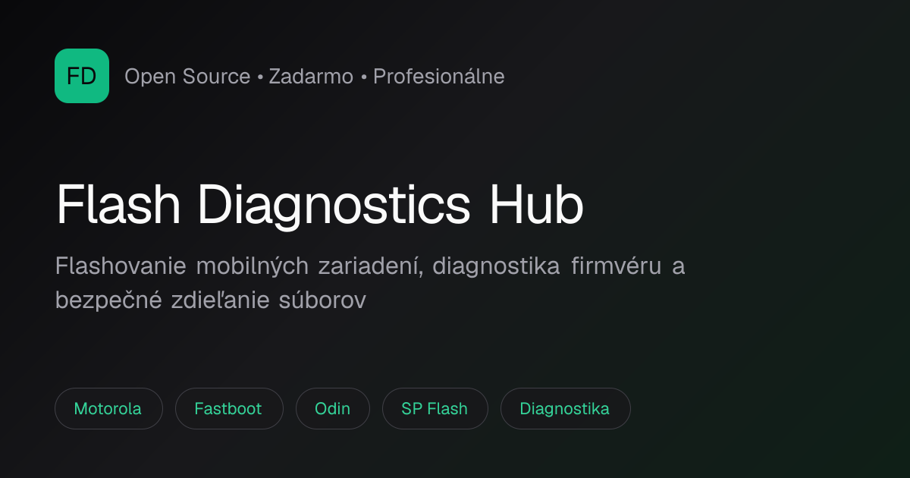

# Flash Diagnostics Hub

[](https://flash-diagnostics-hub.vercel.app)
[](https://flash-diagnostics-hub.vercel.app)
[](https://nextjs.org)
[](https://github.com/JVVMEDIA/flash-diagnostics-hub)

Profesionálne open-source centrum pre **flashovanie mobilných zariadení**, **diagnostiku firmvéru** a **bezpečné zdieľanie chránených súborov**. Obsah je v slovenčine, postupy sú založené na oficiálnych nástrojoch a legálnych metódach.

[**Otvoriť live stránku →**](https://flash-diagnostics-hub.vercel.app)

## Náhľad

[](https://flash-diagnostics-hub.vercel.app)

## Čo projekt ponúka

- **Rozbaliteľné sekcie** s podsekciami, krokmi, tipmi a upozorneniami
- **Priame odkazy na súbory** — nástroje, drivery, firmvérové balíky
- **Podpora značiek** — Samsung, Motorola, Xiaomi, Google Pixel, OnePlus, MediaTek, Qualcomm
- **Interaktívny generátor** inštrukcií pre bezpečné zdieľanie ZIP/7z archívov
- **Animované UI** — CSS aurora pozadie, scroll efekty, brand marquee, aktívna navigácia
- **Open Graph / Twitter preview** pre zdieľanie odkazu na sociálnych sieťach

## Hlavné sekcie

| Sekcia | Obsah |
|--------|--------|
| **Flashovanie** | Fastboot/ADB, Motorola, Odin (Samsung), SP Flash Tool (MediaTek) |
| **Diagnostika** | Bootloop/brick, EDL (Qualcomm), USB/driver problémy, Motorola špecifiká |
| **Nástroje** | Fastboot, Odin, SP Flash, Mi Flash, LMSA, odkazy na stiahnutie |
| **Firmvérové balíky** | Oficiálne zdroje pre Motorola, Samsung, Xiaomi, Pixel |
| **Zdieľanie** | Platformy (WeTransfer, Google Drive…), bezpečnostné odporúčania, generátor hesiel |

## Technológie

- [Next.js 16](https://nextjs.org) (App Router, Turbopack)
- [React 19](https://react.dev)
- [Tailwind CSS 4](https://tailwindcss.com)
- [Framer Motion](https://www.framer.com/motion/) — scroll animácie a interaktívne komponenty
- [Lucide React](https://lucide.dev) — ikony
- [Simple Icons CDN](https://simpleicons.org) — logá značiek a nástrojov
- Deploy: [Vercel](https://vercel.com)

## Lokálne spustenie

```bash
git clone https://github.com/JVVMEDIA/flash-diagnostics-hub.git
cd flash-diagnostics-hub
npm install
npm run dev
```

Otvor [http://localhost:3000](http://localhost:3000).

### Ďalšie príkazy

```bash
npm run build   # produkčný build
npm run start   # spustenie buildu
npm run lint    # ESLint
```

## Štruktúra projektu

```
app/
├── components/          # UI komponenty (Hero, Navbar, karty, animácie)
├── data/
│   ├── hub-content.ts   # Všetok textový obsah, sekcie a odkazy
│   └── brands.ts        # Značky a flash nástroje
├── hooks/               # useActiveSection (aktívna navigácia)
├── opengraph-image.tsx  # OG náhľad pre zdieľanie
├── page.tsx             # Hlavná stránka
└── layout.tsx           # Layout, metadata, pozadie
docs/
└── preview.png          # Náhľad pre README
```

## Úprava obsahu

Väčšina textov a odkazov je v jednom súbore:

`app/data/hub-content.ts`

Značky a nástroje v:

`app/data/brands.ts`

Po úprave stačí commit + push — Vercel nasadí zmeny automaticky.

## Deploy

Projekt je nasadený na Vercele a prepojený s GitHub repozitárom. Push do vetvy `main` spustí automatický deploy.

**Produkčná URL:** https://flash-diagnostics-hub.vercel.app

## Autor

**JVVMEDIA** — [GitHub](https://github.com/JVVMEDIA)

---

*Open Source • Zadarmo • Profesionálne postupy*